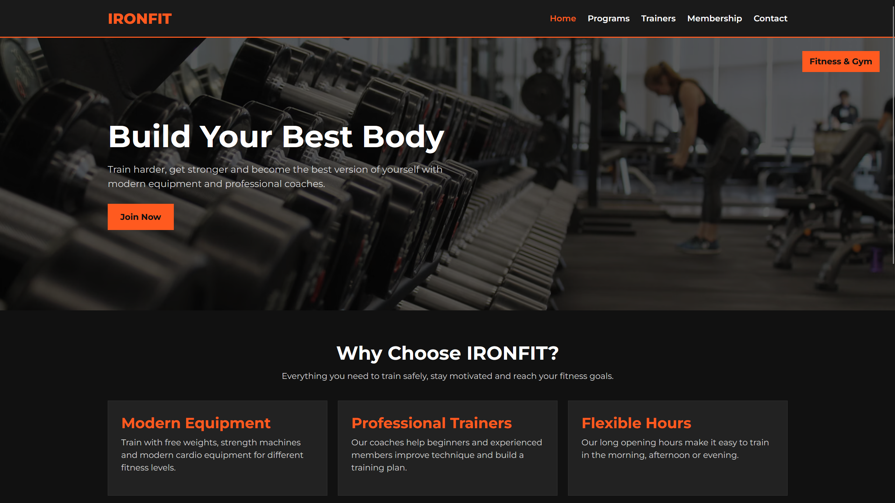
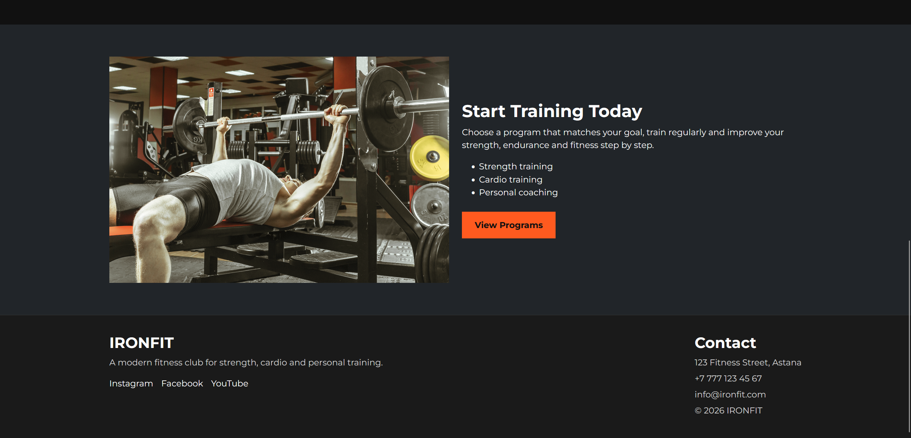
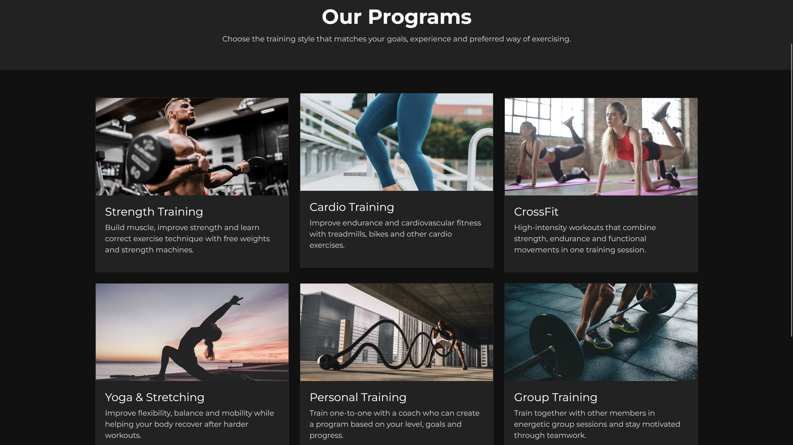
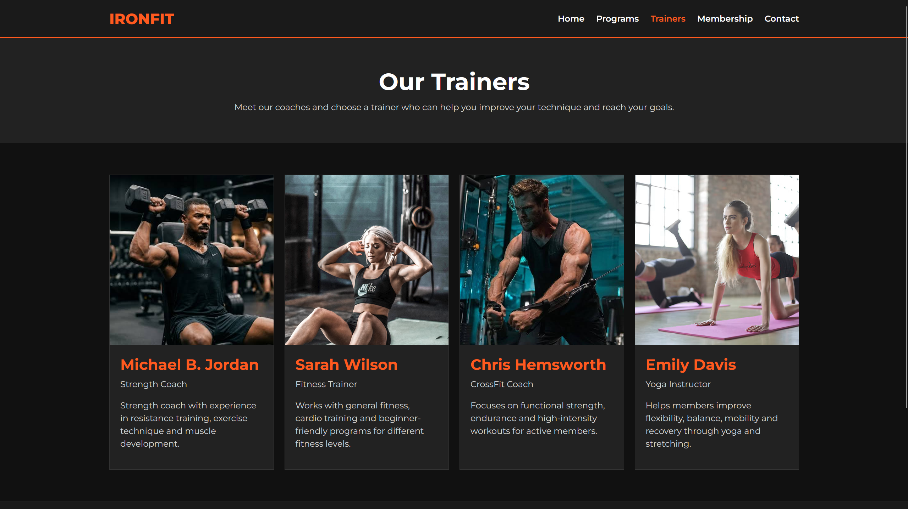
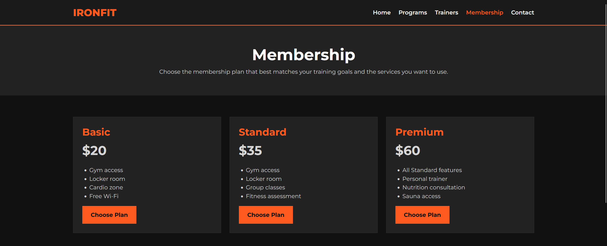
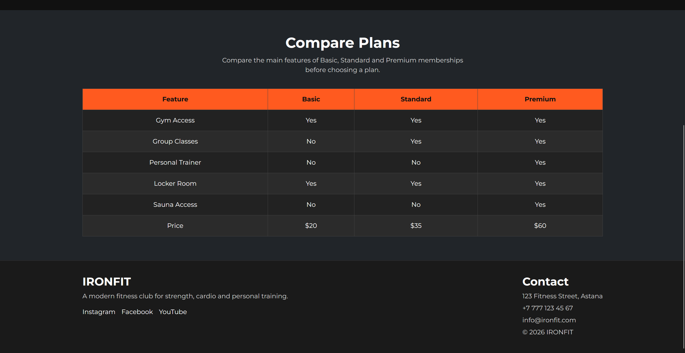
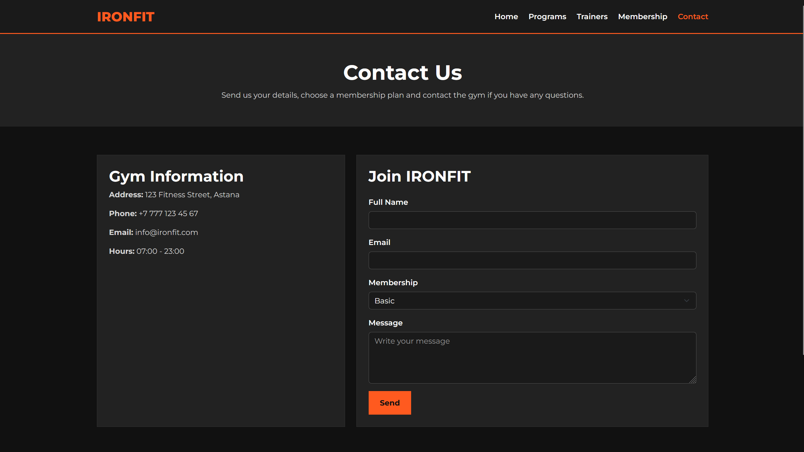

# IRONFIT - Fitness & Gym Website

## Project Topic

IRONFIT is a responsive multi-page website created for a modern fitness gym.

## Group Members

- Yernar Kuanyshbek
- Ramazan Sailau
- Adilbek Nazhim

## Project Description

IRONFIT is a fitness and gym website where users can learn about the gym, view available training programs, meet professional trainers, compare membership plans, and contact the gym.

The website contains five pages and is designed to work on desktop, tablet, and mobile devices.

## Features

- 5 responsive pages
- Navigation bar on every page
- Home page with main gym information
- Training programs section
- Trainer profiles
- Membership plans
- Membership comparison table
- Contact form
- Responsive design
- Hover effects on program and trainer cards
- Footer with contact information and social links

## Technologies Used

- HTML5
- CSS3
- Bootstrap 5
- Flexbox
- CSS Grid
- Media Queries
- Google Fonts

## Pages

### Home
The main page introduces the gym and shows the main advantages of IRONFIT.

---

### Programs
This page contains different fitness programs such as strength training, cardio, CrossFit, yoga, personal training, and group training.

---

### Trainers
This page introduces the gym trainers and shows their specialization and experience.

---

### Membership
This page contains different membership plans and a comparison table.

---

### Contact
This page contains gym contact information and a form where users can send a message.

---

## Individual Contribution

### Student 1 (Yernar Kuanyhsbek)

- Home page
- Header and navigation
- Footer
- General website styling

### Student 2 (Ramazan Sailau)

- Programs page
- Trainers page
- Card design and hover effects

### Student 3 (Adilbek Nazhim)

- Membership page
- Contact page
- Membership table and contact form

## Responsive Design

The website uses Bootstrap Grid, CSS Grid, Flexbox, and media queries to adapt the layout for different screen sizes.

On smaller screens, cards move into fewer columns and the navigation layout changes to make the website easier to use.

